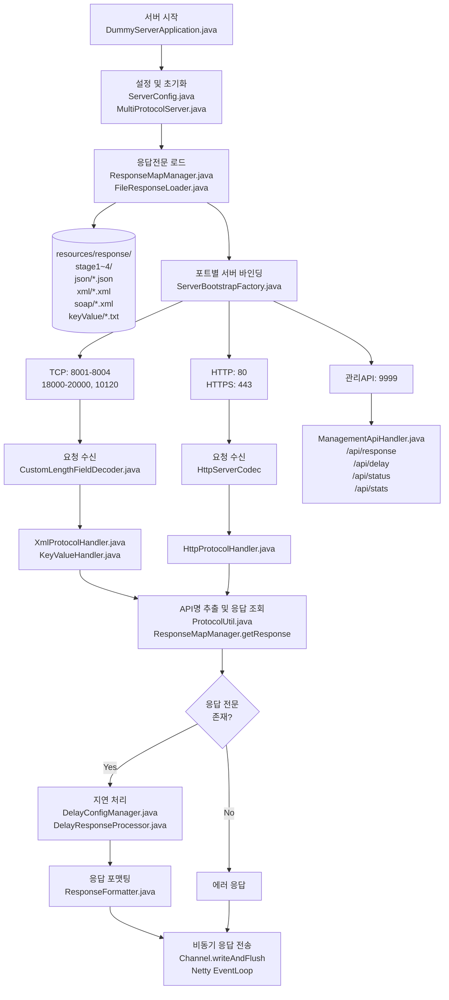

# Dummy Server

## 프로젝트 개요
Azure Migration를 위한 Dummy Server입니다.

## 메인 로직
```
┌──────────────────────────────────────────────┐
│           FileResponseLoader(응답 전문)       │
│                                              │
│  resources/response/                         │
│    ├── stage1/                               │
│    │   ├── json/ (*.json)                    │
│    │   ├── xml/ (*.xml)                      │
│    │   ├── soap/ (*.xml)                     │
│    │   └── keyValue/ (*.txt)                 │
│    ├── stage2/                               │
│    ├── stage3/                               │
│    └── stage4/                               │
└────────────────┬─────────────────────────────┘
                 │ 초기화 시 로드
                 ▼
┌──────────────────────────────────────────────┐
│           ResponseMapManager                 │
│                                              │
│  Map<protocol, Map<apiName, response>>       │
│                                              │
└──────────────────────────────────────────────┘
```

## 로직 처리 플로우



## 지연 응답 기능 사용법
```
# 전역 지연 설정
curl -X POST "http://localhost:9999/api/delay?enable=true&min=100&max=300"

# 특정 포트만 설정
curl -X POST "http://localhost:9999/api/delay?port=8001&enable=true&min=50&max=150"

# 현재 설정 확인
curl -X POST http://localhost:9999/api/delay
```


### 사용 라이브러리
- **Java**: 17
- **Netty**: 4.1.104.Final
- **Jackson**: 2.16.1 
- **SLF4J**: 2.0.12
- **Logback**: 1.4.14

## 지원 프로토콜 및 포트

### A그룹 (TCP Socket + XML)
- **포트**: 8001, 8002, 8003, 8004
- **프로토콜**: TCP Socket
- **데이터 형식**: XML

### B그룹 (TCP Socket + &key=value)
- **포트**: 18000, 19000, 20000, 10120
- **프로토콜**: TCP Socket
- **데이터 형식**: &key=value

### C그룹 (HTTP)
- **포트**: 80
- **프로토콜**: HTTP
- **데이터 형식**: JSON, XML, SOAP

### D그룹 (HTTPS)
- **포트**: 443
- **프로토콜**: HTTPS, mTLS
- **데이터 형식**: JSON, multipart, SOAP

### 관리 API
- **포트**: 9999
- **프로토콜**: HTTP
- **용도**: 응답 전문 관리, 모니터링

## 성능 최적화 JVM 옵션

```bash
-Xms2g -Xmx4g                          # 힙 메모리 설정
-XX:+UseG1GC                           # G1 GC 사용
-XX:MaxGCPauseMillis=100               # GC 일시정지 시간 목표
-XX:+UseStringDeduplication            # 문자열 중복 제거
-XX:+OptimizeStringConcat              # 문자열 연결 최적화
-Dio.netty.allocator.type=pooled       # Netty 메모리 풀 사용
-Dio.netty.allocator.numDirectArenas=0 # Direct 메모리 아레나 비활성화
```


## 관리 API 사용법

### 상태 확인
```bash
curl http://localhost:9999/api/status
```

### 성능 통계 조회
```bash
curl http://localhost:9999/api/stats
```

### 응답 전문 등록/업데이트
```bash
curl -X POST http://localhost:9999/api/response \
  -H "Content-Type: application/json" \
  -d '{
    "stage": "stage1",
    "protocol": "json",
    "apiName": "newApi",
    "responseContent": "{\"result\":\"success\",\"data\":\"test\"}"
  }'
```

## 포트 구성

| 그룹 | 포트 | 프로토콜 | 데이터 형식 |
|------|------|----------|-------------|
| A | 8001-8004 | TCP Socket | XML |
| B | 18000,19000,20000,10120 | TCP Socket | &key=value |
| C | 80 | HTTP | JSON,XML,SOAP |
| D | 443 | HTTPS | JSON,multipart,SOAP |
| 관리 | 9999 | HTTP | JSON (관리 API) |

## 문제 해결

### 포트 충돌
```bash
# 포트 사용 확인
netstat -tlnp | grep -E ':(80|443|8001|8002|8003|8004|9999|18000|19000|20000|10120)'

# 프로세스 종료
kill -9 $(lsof -t -i:8001)
```

### 메모리 부족
```bash
# 메모리 사용률 확인
free -h

# JVM 힙 덤프 생성
jmap -dump:format=b,file=heapdump.hprof $(cat dummy-server.pid)
```

## 개발자 정보

이 프로젝트는 --------------------------------
